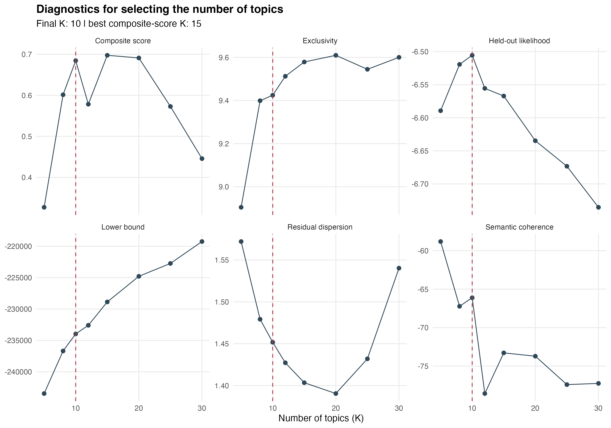
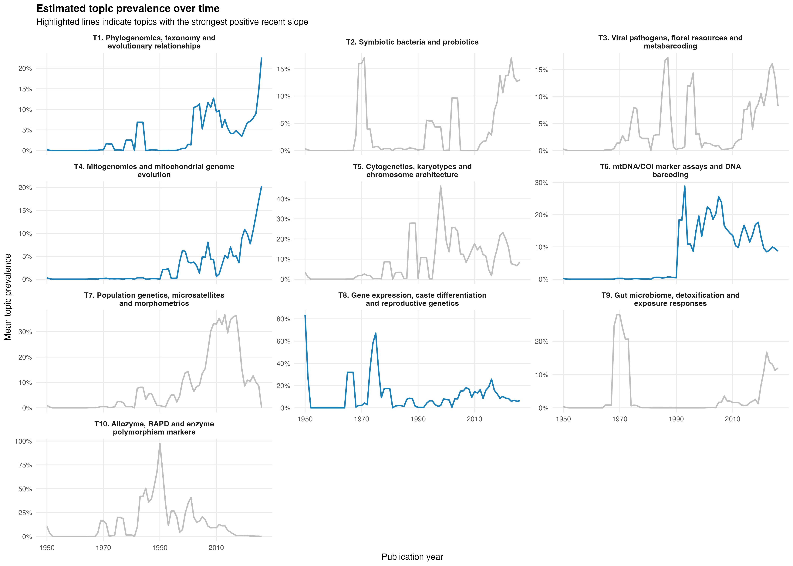
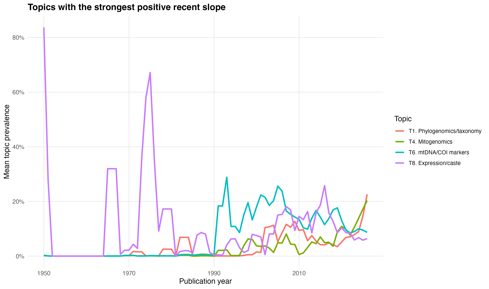
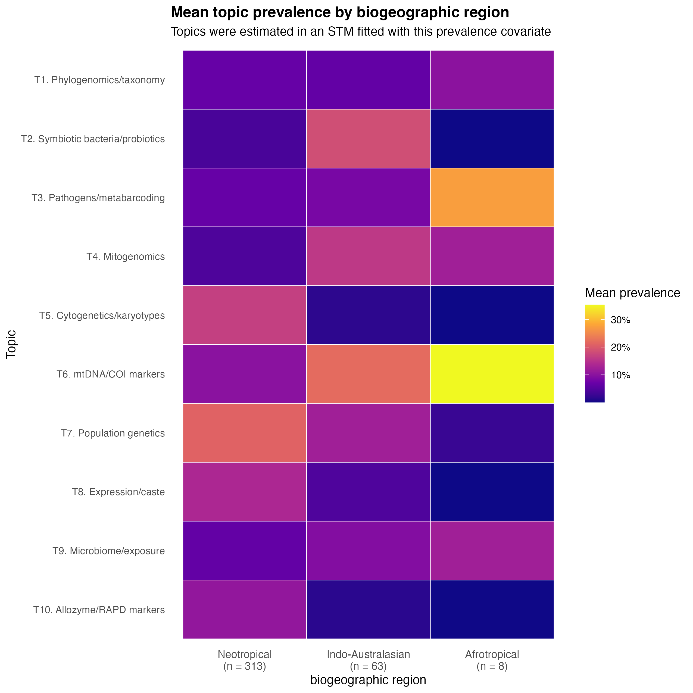
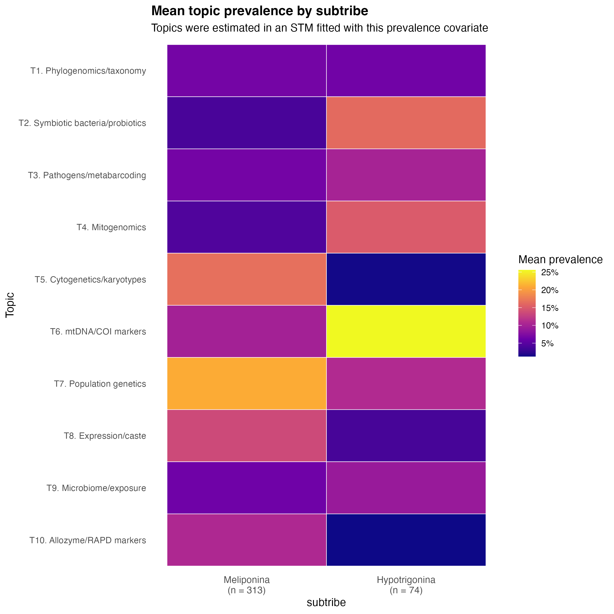
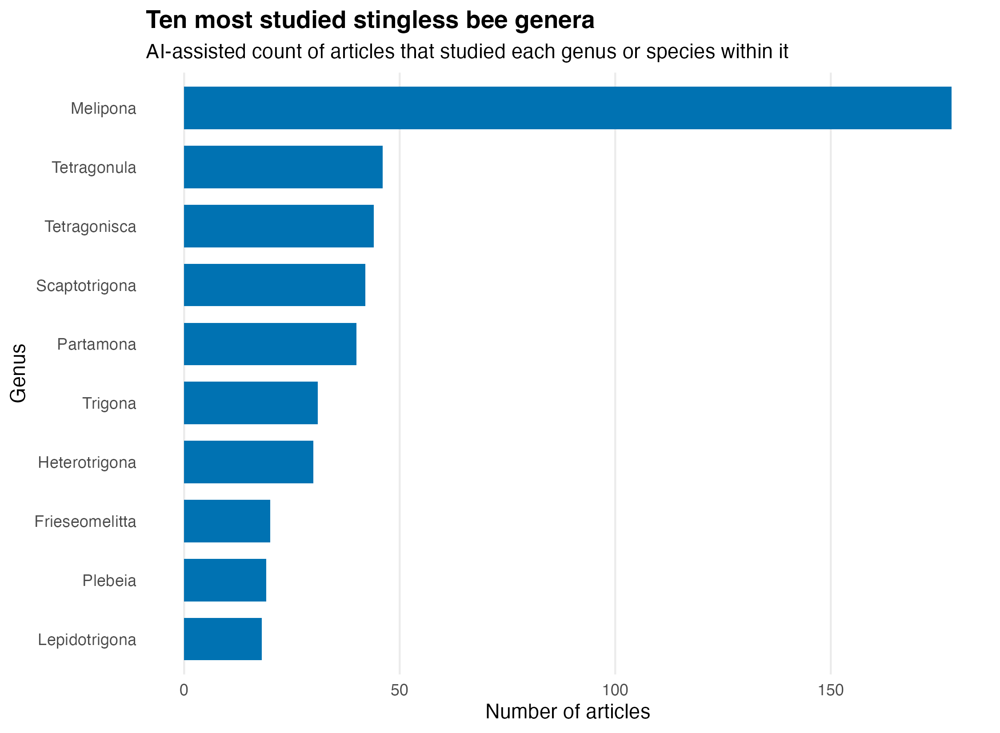
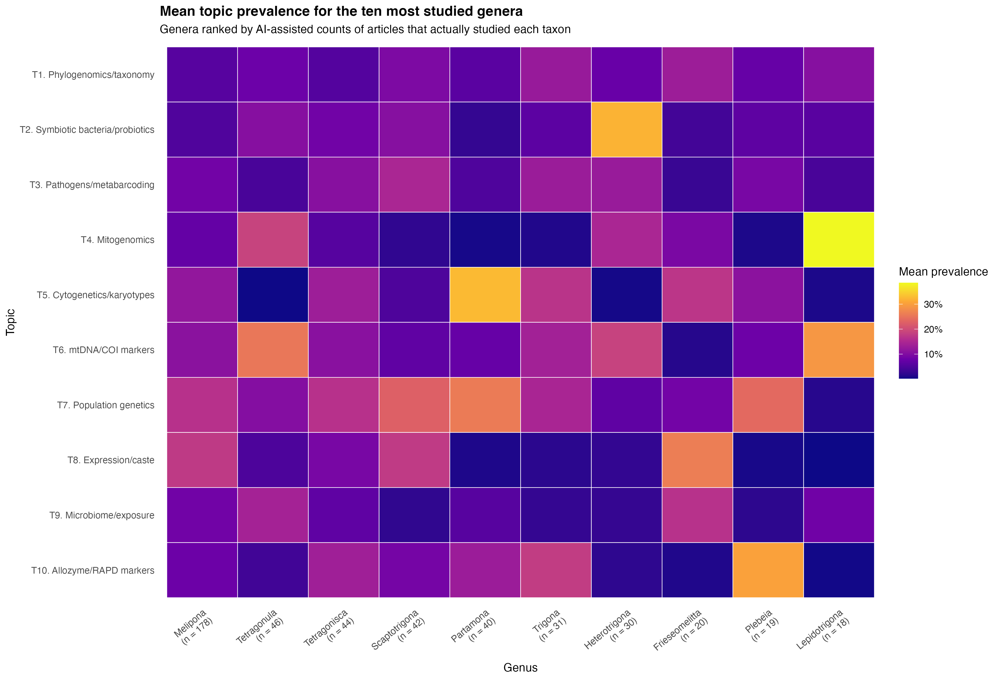

# Relatorio final das analises para o artigo

## Escopo desta versao

Este relatorio resume a versao final das analises da revisao sobre estudos geneticos e genomicos em Meliponini. A versao final usa o corpus mesclado Scopus + Web of Science, apos remocao de itens nao-artigo identificados na WoS, e adota `K = 10` como solucao principal do STM.

Diretorios principais:

- Corpus final: `data/merged/merged_scopus_wos_articles_only_genetics_genomics_corpus_20260503.csv`
- Covariaveis por artigo: `data/merged/article_taxon_covariates_scopus_wos_articles_only_20260503.csv`
- STM final e figuras do artigo: `results/article_final_merged_scopus_wos_articles_only/`
- Contagens taxonomicas por IA: `data/article_counts_ai_merged_scopus_wos_articles_only/`
- Filogenia com mapa de calor: `results/phylo_genus_merged_scopus_wos_articles_only_with_polyphyletic/`

As analises exploratorias antigas, incluindo modelos Scopus-only, modelos com `K = 15` ou `K = 25` e versoes antes da remocao dos itens nao-artigo, nao sao usadas como resultado principal nesta versao. Elas ficam apenas como historico/sensibilidade.

## Enquadramento PRISMA-EcoEvo

A revisao deve ser apresentada como um mapa sistematico da evidencia e sintese bibliometrica/tematica, nao como meta-analise. A formulacao mais segura e indicar adesao ao PRISMA-EcoEvo "where applicable", porque nao foram estimados tamanhos de efeito nem combinados resultados experimentais.

Texto sugerido:

> We structured the review according to the PRISMA-EcoEvo reporting framework, where applicable. Because our aim was to map thematic, taxonomic and biogeographic patterns in the genetic and genomic literature on Meliponini rather than estimate a pooled effect size, the study is presented as a systematic evidence map and bibliometric synthesis, not as a meta-analysis.

Itens que ainda precisam entrar no manuscrito ou suplemento:

- string de busca final da Scopus e da Web of Science;
- data exata das buscas;
- criterios operacionais de inclusao e exclusao;
- fluxograma PRISMA com identificacao, deduplicacao, triagem, exclusoes e corpus final;
- declaracao sobre protocolo/pre-registro;
- checklist PRISMA-EcoEvo preenchida;
- descricao explicita do uso de IA na triagem e na contagem taxonomica.

## Triagem e corpus final

A busca Scopus executada por `scripts/download_scopus_meliponini.R` retornou 4.961 registros brutos. Apos remocao de duplicatas internas, 4.951 registros foram triados. A curadoria final da Scopus usada nas analises continha 383 artigos.

A busca manual na Web of Science foi importada em cinco arquivos BibTeX. A importacao gerou 4.400 registros brutos, 4.396 registros apos deduplicacao interna e 779 registros exclusivos em relacao a Scopus. Esses 779 registros exclusivos foram triados por IA; 31 foram classificados como relevantes. Apos checagem manual, esses 31 eram relevantes quanto ao tema, mas 4 foram removidos da analise final por serem itens nao-artigo no corpus WoS.

| Fonte/etapa | Registros |
|---|---:|
| Scopus final curada | 383 |
| WoS exclusivos relevantes antes da exclusao de nao-artigos | 31 |
| WoS removidos como itens nao-artigo | 4 |
| WoS exclusivos mantidos como artigos | 27 |
| Corpus final Scopus + WoS | 410 |
| Duplicatas adicionais apos a fusao | 0 |

Os 4 registros removidos estao auditados em `data/wos_excluded_non_article_records_20260503.csv`.

O corpus final inclui artigos publicados entre 1950 e 2026. O ano de 2026 deve ser interpretado com cautela porque a busca foi encerrada em maio de 2026, portanto o ano esta incompleto.

## Processamento textual

O STM usou titulo, resumo, palavras-chave dos autores e palavras-chave indexadas. Para reduzir vies taxonomico e geografico, foram removidos:

- nomes de generos, especies, subgeneros e epitetos especificos de `data/Meliponini_species.xlsx`;
- stopwords gerais em ingles;
- termos gerais do dominio, como `bee`, `bees`, `stingless`, `meliponini`, `species`, `genus` e `genera`;
- localidades e residuos lexicais em `data/stm_extra_stopwords_localities_residuals.txt`.

Essa limpeza foi essencial porque o objetivo do artigo e recuperar tipos de estudos geneticos/genomicos, nao simplesmente agrupar artigos por taxon ou localidade.

## Escolha final de K

O modelo temporal principal foi ajustado com ano de publicacao como covariavel de prevalencia:

```r
prevalence = ~ s(year)
```

Foram avaliados `K = 5, 8, 10, 12, 15, 20, 25, 30`. A tabela abaixo mostra os diagnosticos principais. Em coerencia semantica, valores menos negativos indicam melhor coerencia; em exclusividade, valores maiores indicam topicos mais exclusivos.

| K | Semantic coherence | Exclusivity | Coherence-exclusivity balance | Composite score |
|---:|---:|---:|---:|---:|
| 5 | -58.821 | 8.904 | 0.500 | 0.327 |
| 8 | -67.232 | 9.399 | 0.638 | 0.601 |
| 10 | -66.124 | 9.424 | 0.684 | 0.684 |
| 12 | -78.561 | 9.512 | 0.431 | 0.578 |
| 15 | -73.282 | 9.579 | 0.612 | 0.697 |
| 20 | -73.710 | 9.610 | 0.623 | 0.691 |
| 25 | -77.402 | 9.545 | 0.483 | 0.573 |
| 30 | -77.245 | 9.600 | 0.527 | 0.446 |

`K = 10` foi mantido como solucao final porque apresentou o melhor equilibrio direto entre coerencia semantica e exclusividade. `K = 5` teve a melhor coerencia semantica, mas agregou temas demais. `K = 20` teve a maior exclusividade, mas fragmentou a literatura em subtitulos mais finos. `K = 15` teve o maior escore composto nesta semente, principalmente por contribuicoes de outros diagnosticos, mas a diferenca em relacao a `K = 10` foi pequena e a solucao com 10 topicos e mais parcimoniosa e alinhada ao objetivo biologico do artigo.

Figura suplementar recomendada:



## Topicos finais

Os rotulos abaixo foram definidos em ingles para uso direto no artigo.

| Topico | Rotulo em ingles | Nome curto | Tema amplo |
|---:|---|---|---|
| 1 | Phylogenomics, taxonomy and evolutionary relationships | Phylogenomics/taxonomy | Evolutionary relationships and taxonomy |
| 2 | Symbiotic bacteria and probiotics | Symbiotic bacteria/probiotics | Microbiome and symbiosis |
| 3 | Viral pathogens, floral resources and metabarcoding | Pathogens/metabarcoding | Disease ecology and environmental DNA |
| 4 | Mitogenomics and mitochondrial genome evolution | Mitogenomics | Genome architecture and comparative genomics |
| 5 | Cytogenetics, karyotypes and chromosome architecture | Cytogenetics/karyotypes | Cytogenetics and cytogenomics |
| 6 | mtDNA/COI marker assays and DNA barcoding | mtDNA/COI markers | Marker assays, barcoding and molecular identification |
| 7 | Population genetics, microsatellites and morphometrics | Population genetics | Population structure and phenotypic differentiation |
| 8 | Gene expression, caste differentiation and reproductive genetics | Expression/caste | Functional and reproductive genomics |
| 9 | Gut microbiome, detoxification and exposure responses | Microbiome/exposure | Microbiome and environmental stress |
| 10 | Allozyme, RAPD and enzyme polymorphism markers | Allozyme/RAPD markers | Classical marker-based genetics |

Tabela completa com termos `prob`, `frex`, `lift`, `score` e justificativas:

`results/article_final_merged_scopus_wos_articles_only/stm_topic_labels_article_named.csv`

Observacao importante para a interpretacao: os topicos 6, 7 e 10 pertencem a um mesmo eixo maior de estudos baseados em marcadores. A distincao do STM nao deve ser lida como separacao biologica rigida, mas como separacao historico-metodologica: marcadores mtDNA/COI e RFLP; aplicacoes em genetica populacional/morfometria; e marcadores classicos como aloenzimas/RAPD.

## Tendencias temporais



O destaque temporal foi calculado pela inclinacao de uma regressao linear simples entre prevalencia media anual do topico e ano de publicacao dentro da janela recente de cinco anos (`2022-2026`). Portanto, ele mede aumento recente, nao prevalencia absoluta recente. Apos revisao, apenas topicos com inclinacao positiva sao destacados nas figuras.

Topicos com maior inclinacao positiva no periodo recente:

| Rank | Topico | Tema | Prevalencia media recente | Inclinacao recente | Prevalencia em 2026 |
|---:|---:|---|---:|---:|---:|
| 1 | T1 | Phylogenomics/taxonomy | 0.115 | 0.035 | 0.226 |
| 2 | T4 | Mitogenomics | 0.137 | 0.034 | 0.203 |
| 3 | T6 | mtDNA/COI markers | 0.092 | 0.003 | 0.087 |
| 4 | T8 | Expression/caste | 0.062 | 0.002 | 0.064 |



Interpretacao principal: as frentes recentes mais claras sao filogenomica/taxonomia e mitogenomica. Esses temas representam a transicao de estudos baseados em poucos marcadores para dados genômicos e comparativos mais amplos. Symbiotic bacteria/probiotics, microbiome/exposure e pathogens/metabarcoding tambem apresentam alta prevalencia recente, mas nao aparecem com a maior inclinacao positiva na janela final, em parte porque 2026 esta incompleto.

## STM com regiao como covariavel

A covariavel `region_for_stm` foi derivada dos generos efetivamente estudados em cada artigo, segundo a classificacao por IA, e da distribuicao dos generos na Tabela 1 de Lepeco et al. (2024). As categorias biologicas principais sao:

- Neotropical;
- Afrotropical;
- Indo-Australasian.

Tambem foram mantidas categorias operacionais para auditoria:

- `Multi-region`: artigo com generos estudados pertencentes a mais de uma regiao;
- `Unassigned`: artigo sem genero atribuido pela IA ou sem ligacao clara com uma das tres regioes.

Distribuicao dos artigos:

| Categoria | Documentos |
|---|---:|
| Neotropical | 313 |
| Indo-Australasian | 63 |
| Afrotropical | 8 |
| Multi-region | 11 |
| Unassigned | 15 |

Figura principal, mantendo apenas as tres regioes biologicas:



Padroes principais:

- Neotropical: maior prevalencia de population genetics, cytogenetics/karyotypes, expression/caste e allozyme/RAPD markers.
- Indo-Australasian: maior prevalencia relativa de mtDNA/COI markers, symbiotic bacteria/probiotics, mitogenomics e microbiome/exposure.
- Afrotropical: maior prevalencia de mtDNA/COI markers e pathogens/metabarcoding, mas a amostra e pequena (`n = 8`), entao esse resultado deve ser tratado como indicativo.

Arquivos de auditoria com todas as categorias:

- `results/article_final_merged_scopus_wos_articles_only/stm_region_covariate_k10_topic_prevalence.csv`
- `results/article_final_merged_scopus_wos_articles_only/stm_region_covariate_k10_topic_prevalence_heatmap.png`

## STM com subtribo como covariavel

A covariavel `subtribe_for_stm` foi derivada dos generos efetivamente estudados em cada artigo. As categorias principais foram `Meliponina` e `Hypotrigonina`, com categorias operacionais `Multi-subtribe` e `Unassigned` mantidas para auditoria.

Distribuicao dos artigos:

| Categoria | Documentos |
|---|---:|
| Meliponina | 313 |
| Hypotrigonina | 74 |
| Multi-subtribe | 11 |
| Unassigned | 12 |

Figura principal, mantendo apenas as duas subtribos:



Padroes principais:

- Meliponina: maior prevalencia de population genetics, cytogenetics/karyotypes, expression/caste e allozyme/RAPD markers.
- Hypotrigonina: maior prevalencia relativa de mtDNA/COI markers, symbiotic bacteria/probiotics, mitogenomics, population genetics e pathogens/metabarcoding.

Essa analise deve ser interpretada como estrutura da literatura, nao como diferenca biologica intrinseca entre subtribos. Ha forte dependencia entre subtribo, regiao e composicao taxonomica: muitos artigos Neotropicais sao de Meliponina, enquanto boa parte dos artigos Indo-Australasian/Afrotropical envolve Hypotrigonina.

## Contagem taxonomica por IA

A contagem por genero e especie foi feita em duas etapas:

1. deteccao automatica de candidatos por correspondencia de nomes de generos/especies no titulo, resumo e palavras-chave;
2. classificacao por IA para decidir se o taxon foi efetivamente estudado ou apenas mencionado.

Quando um artigo estudou mais de um genero ou especie, ele foi contado para cada taxon correspondente. Portanto, as contagens por genero/especie nao sao mutuamente exclusivas.

Apos a remocao dos quatro itens nao-artigo da WoS, as classificacoes de IA foram remapeadas por chave bibliografica (`dedup_key`) para preservar as decisoes ja auditadas. O remapeamento cobriu 1.272 candidatos e nao deixou classificacoes ausentes.

Top 10 generos mais estudados:

| Genero | Artigos |
|---|---:|
| Melipona | 178 |
| Tetragonula | 46 |
| Tetragonisca | 44 |
| Scaptotrigona | 42 |
| Partamona | 40 |
| Trigona | 31 |
| Heterotrigona | 30 |
| Frieseomelitta | 20 |
| Plebeia | 19 |
| Lepidotrigona | 18 |





Padroes exploratorios por genero:

- `Melipona`: expression/caste, population genetics e cytogenetics/karyotypes.
- `Tetragonula`: mtDNA/COI markers, mitogenomics e microbiome/exposure.
- `Tetragonisca`: population genetics, allozyme/RAPD markers e cytogenetics/karyotypes.
- `Scaptotrigona`: population genetics, expression/caste e pathogens/metabarcoding.
- `Partamona`: cytogenetics/karyotypes, population genetics e allozyme/RAPD markers.
- `Heterotrigona`: symbiotic bacteria/probiotics, mtDNA/COI markers e mitogenomics.
- `Lepidotrigona`: mitogenomics, mtDNA/COI markers e phylogenomics/taxonomy.

Essas associacoes sao exploratorias, pois refletem a composicao dos artigos disponiveis e podem ser influenciadas por poucos estudos em alguns generos.

## Filogenia e vies taxonomico

A filogenia original usada foi:

`data/phylo/meliponini_lepeco2024_opentree.tre`

A arvore de genero foi construida como uma representacao simplificada, mas preservando os generos nao monofileticos como multiplas posicoes filogeneticas quando necessario:

- os tips foram mapeados para generos;
- um representante por genero monofiletico foi mantido;
- generos nao monofileticos foram mantidos como "ilhas" ou subconjuntos filogeneticos maximos do mesmo genero;
- cada ilha nao monofiletica foi representada por um unico tip com asterisco antes do nome do genero, por exemplo `*Lepidotrigona`;
- a contagem/cor de cada tip com asterisco corresponde ao valor total do genero, sem dividir a contagem entre as diferentes posicoes da arvore;
- a arvore foi convertida para uma versao ultrametrica com `compute.brlen(..., method = "Grafen")`;
- a escala de cor usa `log1p(numero de artigos)` para reduzir a dominancia visual de `Melipona`;
- marcadores laterais indicam as subtribos Hypotrigonina e Meliponina.

Resultado:

- generos representados na arvore simplificada: 44;
- tips totais na arvore simplificada: 49;
- generos nao monofileticos incluidos com asterisco: 4;
- numero de ilhas por genero nao monofiletico: `Frieseomelitta` = 3, `Geniotrigona` = 2, `Lepidotrigona` = 2, `Plebeia` = 2;
- ramos coloridos pela media dos valores dos generos descendentes;
- pontos nos tips coloridos pela contagem do genero.


A figura mostra que o esforco de pesquisa e fortemente concentrado em poucos generos, especialmente `Melipona`, com concentracoes adicionais em `Tetragonula`, `Tetragonisca`, `Scaptotrigona` e `Partamona`. Esse padrao reforca a existencia de vies taxonomico na literatura genetica/genomica de Meliponini.

## Interpretacoes para o artigo

Pontos fortes para a narrativa dos Results/Discussion:

- A literatura esta estruturada por metodos e escalas de dados: marcadores classicos, citogenetica, genetica populacional, mitogenomica, filogenomica, microbioma, patogenos e expressao genica.
- A transicao temporal mais clara e a passagem de marcadores isolados e caracterizacoes citogeneticas para abordagens genomicas, especialmente filogenomica e mitogenomica.
- Marcadores como RFLP, COI, microssatelites, RAPD e aloenzimas nao devem ser tratados como campos biologicos independentes; eles formam um continuum historico-metodologico dentro de estudos de identificacao, diversidade, estrutura populacional e filogeografia.
- O vies taxonomico e forte: `Melipona` domina a base, e muitos padroes tematicos refletem a historia de pesquisa desse genero.
- O vies geografico/subtribal tambem e forte: Neotropical/Meliponina concentra estudos de citogenetica, genetica populacional e expressao/casta; Hypotrigonina e regioes Indo-Australasian/Afrotropical aparecem mais associadas a barcoding, mitogenomica, symbiotic bacteria/probiotics e patogenos, mas com tamanhos amostrais menores.
- A atribuicao regional representa a distribuicao dos generos estudados, nao necessariamente o local exato de coleta de cada estudo. Essa distincao precisa ficar explicita.
- As categorias `Multi-region` e `Unassigned` devem aparecer no suplemento/auditoria, mas nao precisam ser enfatizadas na figura principal do artigo.

Perguntas que podem orientar a discussao:

- Quais linhagens de Meliponini seguem subamostradas em estudos geneticos e genomicos?
- A concentracao em `Melipona` reflete disponibilidade de amostras, relevancia economica/ecologica, tradicao citogenetica ou uma combinacao desses fatores?
- A expansao recente em mitogenomica/filogenomica esta distribuida entre regioes e subtribos ou concentrada em poucos grupos?
- O uso crescente de microbioma, patogenos e metabarcoding indica uma aproximacao entre genetica/genomica, sanidade de colonias, servicos ecossistemicos e ecologia aplicada?

## Texto sugerido para Methods

> We searched Scopus and Web of Science for records related to genetic and genomic studies of stingless bees (Meliponini). Records were deduplicated within and between databases using DOI and normalized title matching. Web of Science records that were unique relative to Scopus were screened with an AI-assisted title/abstract procedure, followed by manual checking. Non-article items identified during curation were excluded from the final corpus. The final corpus comprised 410 articles, including 383 from Scopus and 27 Web of Science-exclusive articles.

> Text for structural topic modelling was built from titles, abstracts, author keywords and indexed keywords. To reduce taxonomic and geographic bias, we removed stingless bee genus and species names, general domain terms, English stopwords, and locality terms before model fitting. Structural topic models were fitted with publication year as the main prevalence covariate. We evaluated K = 5, 8, 10, 12, 15, 20, 25 and 30 and compared semantic coherence, exclusivity, held-out likelihood, residual dispersion and lower-bound diagnostics. The final model used K = 10 because it provided the best balance between semantic coherence and exclusivity while retaining interpretable, non-fragmented research themes.

> To evaluate taxonomic, biogeographic and subtribal structure, candidate genus and species mentions were first detected by string matching and then classified with AI to distinguish taxa actually studied from taxa merely mentioned as background. Articles studying multiple taxa were counted once for each studied taxon. Biogeographic region and subtribe were assigned from the genera judged to be studied in each article, using the distribution categories reported by Lepeco et al. (2024). Additional STM models were fitted with biogeographic region and subtribe as prevalence covariates, using the same K = 10 solution.

## Texto sugerido para Results

> The final corpus included 410 articles published between 1950 and 2026. The final STM used K = 10 topics, selected as a parsimonious solution that balanced semantic coherence and exclusivity. The topics represented phylogenomics/taxonomy, symbiotic bacteria and probiotics, viral pathogens and metabarcoding, mitogenomics, cytogenetics, mtDNA/COI marker assays, population genetics, gene expression and caste/reproductive genetics, gut microbiome and exposure responses, and classical allozyme/RAPD markers.

> The strongest recent increases were associated with phylogenomics/taxonomy and mitogenomics. High recent prevalence was also observed for symbiotic bacteria/probiotic studies, microbiome/exposure responses and pathogen/metabarcoding studies. These patterns suggest a gradual transition from classical marker-based and cytogenetic approaches toward genomic, microbiome and functional genomic studies.

> Topic prevalence differed across biogeographic and subtribal covariates. Neotropical and Meliponina-associated articles were dominated by population genetics, cytogenetics and gene expression/caste topics, whereas Indo-Australasian and Hypotrigonina-associated articles showed relatively higher prevalence of mtDNA/COI markers, symbiotic bacteria/probiotics and mitogenomics. Afrotropical patterns should be interpreted cautiously because of the small number of articles.

> Taxonomic representation was highly uneven. Melipona was by far the most studied genus, followed by Tetragonula, Tetragonisca, Scaptotrigona and Partamona. Mapping article counts onto the genus-level phylogeny showed that this bias is concentrated in a subset of lineages rather than evenly distributed across Meliponini. Non-monophyletic genera were retained as separate phylogenetic positions marked with an asterisk, with each position coloured by the full genus-level article count.

## Limitacoes e cautelas

- O STM foi baseado em titulo, resumo e palavras-chave, nao em texto completo.
- A classificacao por IA foi auditavel e baseada em evidencias textuais, mas ainda depende da informacao disponivel nos resumos.
- O ano de 2026 esta incompleto.
- A escolha de `K = 10` privilegia equilibrio coerencia/exclusividade e interpretabilidade; solucoes com maior K podem separar subtitulos mais finos, mas tambem aumentam fragmentacao.
- A atribuicao biogeografica representa a distribuicao dos generos estudados, nao necessariamente o local exato de coleta de cada estudo.
- Regiao, subtribo e composicao taxonomica nao sao independentes; interpretar os heatmaps como padroes da literatura, nao como diferencas biologicas causais.
- A filogenia em nivel de genero e uma simplificacao para visualizacao; generos nao monofileticos foram representados por multiplas ilhas filogeneticas marcadas com asterisco, evitando colapsa-los em uma unica posicao artificial.

## Arquivos finais recomendados

Principais resultados STM:

- `results/article_final_merged_scopus_wos_articles_only/stm_time_k10/`
- `results/article_final_merged_scopus_wos_articles_only/stm_region_k10/`
- `results/article_final_merged_scopus_wos_articles_only/stm_subtribe_k10/`
- `results/article_final_merged_scopus_wos_articles_only/stm_searchk_results_article_named.csv`
- `results/article_final_merged_scopus_wos_articles_only/stm_searchk_diagnostics_article_labels.png`
- `results/article_final_merged_scopus_wos_articles_only/stm_topic_labels_article_named.csv`
- `results/article_final_merged_scopus_wos_articles_only/stm_topics_over_time_article_labels.png`
- `results/article_final_merged_scopus_wos_articles_only/stm_frontier_topics_article_labels.png`
- `results/article_final_merged_scopus_wos_articles_only/stm_region_covariate_k10_single_region_topic_prevalence_heatmap.png`
- `results/article_final_merged_scopus_wos_articles_only/stm_subtribe_covariate_k10_main_subtribes_topic_prevalence_heatmap.png`
- `results/article_final_merged_scopus_wos_articles_only/stm_topics_by_top10_ai_genera_article_labels.png`

Contagens e filogenia:

- `data/article_counts_ai_merged_scopus_wos_articles_only/meliponini_ai_studied_taxa_counts.xlsx`
- `data/article_counts_ai_merged_scopus_wos_articles_only/meliponini_ai_studied_genus_counts.csv`
- `results/phylo_genus_merged_scopus_wos_articles_only_with_polyphyletic/meliponini_genus_phylo_branch_heatmap.png`
- `results/phylo_genus_merged_scopus_wos_articles_only_with_polyphyletic/meliponini_genus_phylo_branch_heatmap.pdf`
- `results/phylo_genus_merged_scopus_wos_articles_only_with_polyphyletic/meliponini_genus_level_with_polyphyletic.tre`
- `results/phylo_genus_merged_scopus_wos_articles_only_with_polyphyletic/meliponini_genus_tree_tip_metadata.csv`
- `results/phylo_genus_merged_scopus_wos_articles_only_with_polyphyletic/meliponini_genus_level_audit.csv`

Scripts principais:

- `scripts/build_merged_scopus_wos_corpus.R`
- `scripts/count_articles_by_meliponini_genus.R`
- `scripts/classify_taxon_studied_openai.R`
- `scripts/remap_ai_taxon_classifications_after_corpus_filter.R`
- `scripts/build_article_taxon_covariates.R`
- `scripts/run_stm_scopus_bib.R`
- `scripts/prepare_article_final_outputs.R`
- `scripts/summarize_stm_covariate_prevalence.R`
- `scripts/build_genus_level_phylogeny.R`
- `scripts/plot_genus_phylo_branch_heatmap.R`
- `scripts/run_article_final_analysis.sh`
